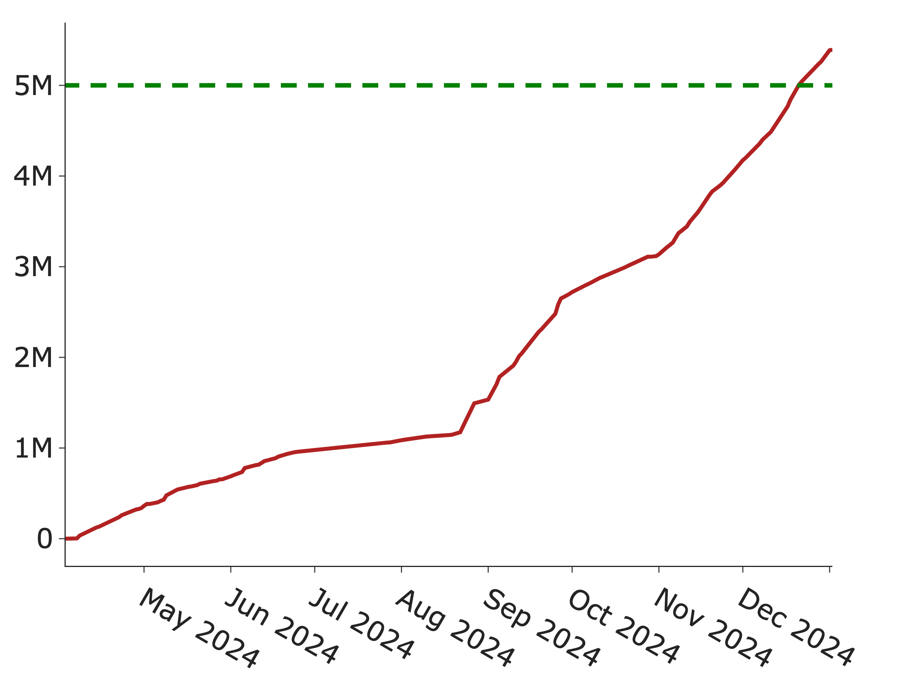
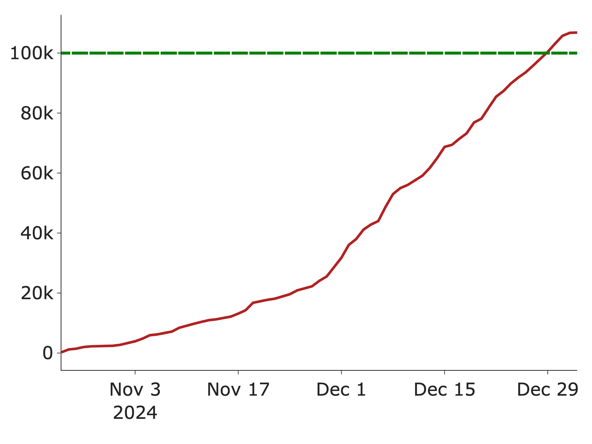
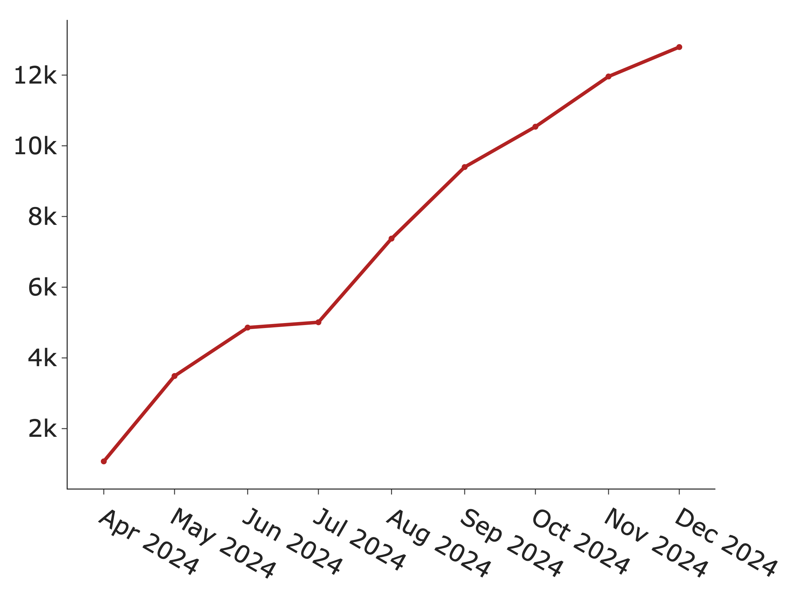
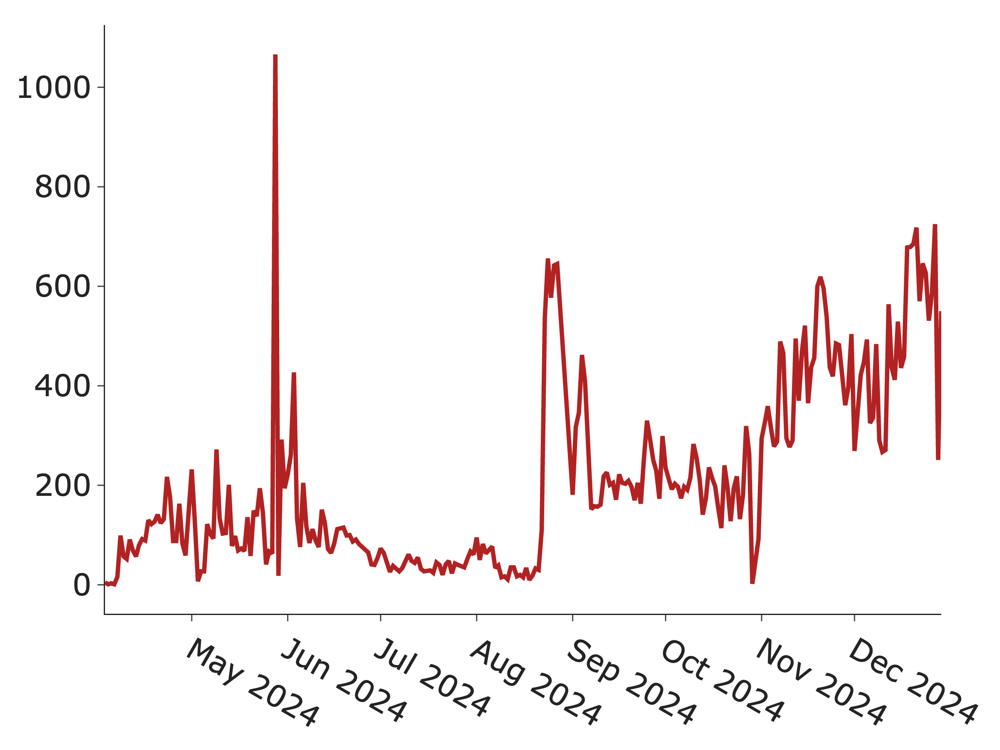

# 📈Data & User Growth

We have successfully scaled the following data viaa Gata's GPT-to-Earn product. All figures are accurate as of December 31, 2024.

* Every \~10 seconds, a ChatGPT user shares their data with us! see real-time on-chain Activity [here](https://greenfieldscan.com/objects?keyword=gpt)

<figure><figcaption>
ChatGPT conversation data growth
</figcaption></figure>

* We have scaled over 5.3M real-user ChatGPT data, representing the largest publicly available human-AI interaction dataset outside of OpenAI. This dataset is highly valuable because (1) it captures real-world use cases and provide deep insights into how AI can better understand and respond to human needs, intentions, and complexities, and (2) ChatGPT is widely recognized as the best AI service.

<figure><figcaption>
ChatGPT o1 reasoning data growth
</figcaption></figure>

* We have scaled over 106k real-user o1 reasoning data, representing the largest publicly available AI reasoning dataset outside of OpenAI. Reasoning AI, often referred to as test-time scaling, represents a new paradigm for enhancing AI capabilities. It has become a primary focus for nearly all leading AI research labs. OpenAI's o1 and o3 reasoning data enable imitation and distillation learning, facilitating the development of other advanced reasoning AI systems.

<figure><figcaption>
ChatGPT users who have shared data with us
</figcaption></figure>

* We have more than 12k real ChatGPT users who have shared data with us.

<figure><figcaption>
Daily Active Data Contributors
</figcaption></figure>

* We have more than 600 daily active data contributors.
